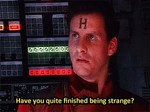

# Hola, I'm Jose Ramon 

### About me
```javascript
const joseRamon = {
  jobTitle: "Full-Stack Web Developer",
  company: "Looking for one!",
  education: "Mechanical Engineering BSc, Master in Design",
  skills: {
    frontend: ["HTML5/CSS3", "JavaScript", "Ruby", "React", "Redux"],
    backend: ["Ruby on Rails", "PostgreSQL", "MySQL", "Nodejs"],
    others: ["Remote work", "Pair programming", "BIM", "Resource Description Framework (RDF)"]
  },
  hobbies: ["Football", "Traveling", "Coding", "Learning new stuff", "Videogames", "Guitar"],
  currentlyLearning: ["threejs", "IFCjs"],
  funFact: "I used to play in a band!"
};
```
### Stats
[](https://github.com/anuraghazra/github-readme-stats) 
